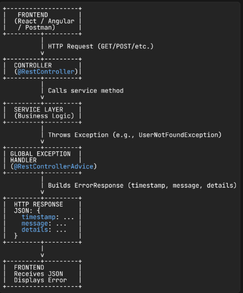

### **Step 1: Create Custom Exception**

* Purpose: Represent a specific error in your app.

```java
public class UserNotFoundException extends RuntimeException {
    public UserNotFoundException(String message) {
        super(message);
    }
}
```

---

### **Step 2: Create Error Response Model**

* Purpose: Standardize the JSON response for errors.

```java
public class ErrorResponse {
    private LocalDateTime timestamp;
    private String message;
    private String details;

    public ErrorResponse(LocalDateTime timestamp, String message, String details) {
        this.timestamp = timestamp;
        this.message = message;
        this.details = details;
    }

    // getters & setters
}
```

---

### **Step 3: Create Global Exception Handler**

* Purpose: Catch exceptions across the app and send a proper response.

```java
@RestControllerAdvice
public class GlobalExceptionHandler {
    
    @ExceptionHandler(UserNotFoundException.class)
    public ErrorResponse handleUserNotFound(UserNotFoundException ex) {
        return new ErrorResponse(LocalDateTime.now(), ex.getMessage(), "Resource not found");
    }

    @ExceptionHandler(Exception.class)
    public ErrorResponse handleGeneralException(Exception ex) {
        return new ErrorResponse(LocalDateTime.now(), ex.getMessage(), "Internal Server Error");
    }
}
```

---

### **Step 4: Throw Exception in Service Layer**

* Purpose: Trigger exception when something goes wrong.

```java
public User getUserById(Long id) {
    return userRepository.findById(id)
            .orElseThrow(() -> new UserNotFoundException("User not found with id: " + id));
}
```

---

### **Step 5: Controller Layer**

* Purpose: Call the service; exceptions are automatically handled.

```java
@GetMapping("/{id}")
public ResponseEntity<User> getUser(@PathVariable Long id) {
    User user = userService.getUserById(id);
    return ResponseEntity.ok(user);
}
```

---

### **Step 6: Optional – HTTP Status Codes**

* Customize HTTP status in the response:

```java
@ExceptionHandler(UserNotFoundException.class)
public ResponseEntity<ErrorResponse> handleUserNotFound(UserNotFoundException ex) {
    ErrorResponse error = new ErrorResponse(LocalDateTime.now(), ex.getMessage(), "Resource not found");
    return new ResponseEntity<>(error, HttpStatus.NOT_FOUND);
}
```

---

